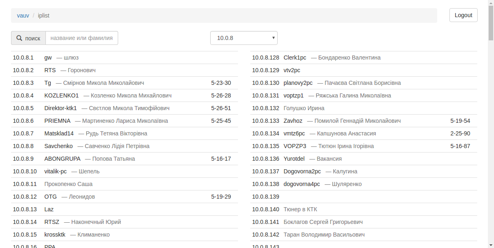
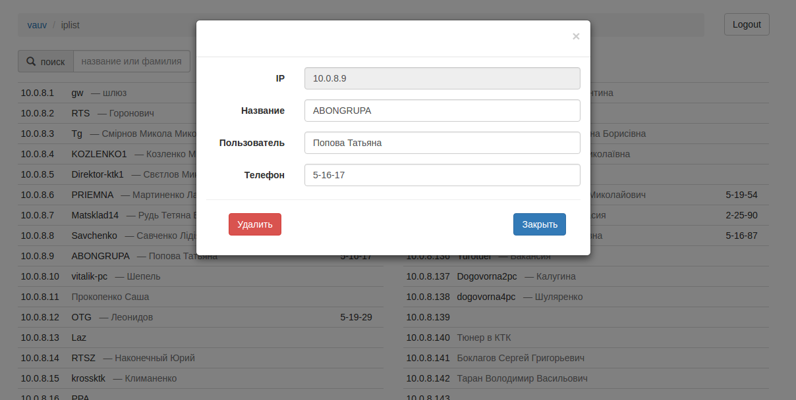

## VAUV IPLIST

Приложение "Справочник ip-адресов"

Служит для просмотра, редактирования, поиска записей в таблице ip-адресов, с возможностью ограничения прав доступа и импортом из csv-файла.

#### Реализация
- при установке плагина создаёт новую таблицу в базе данных, которую и использует
- добавляет в экран управления пользователями админки сайта дополнительные права ("просмотр справочника", "редактирование справочника")
- для обмена данными при поиске, отображении, редактировании, поиске используется `ajax`
- при загрузке данных из csv-файла имеющиеся данные удаляются

#### Использует
- jQuery
- Twitter Bootstrap
- [WordPress Plugin Boilerplate](http://wppb.io/)

#### Скриншоты
Внешний вид приложения

Редактирование записи

