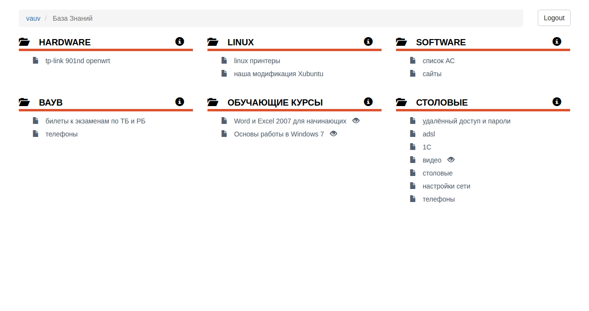
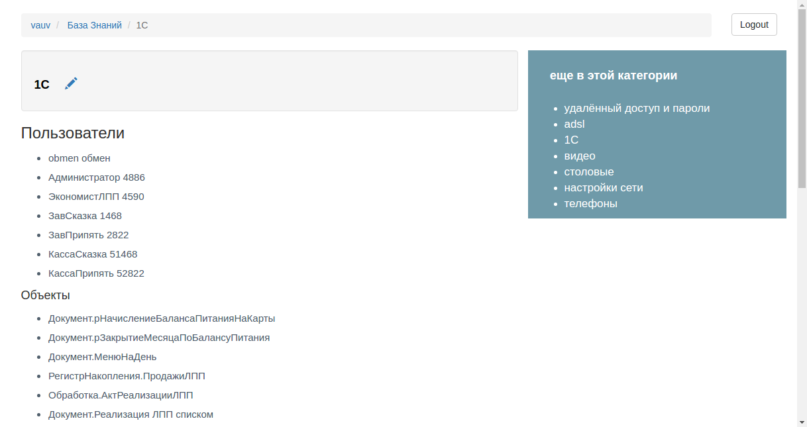
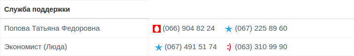

## VAUV KB

Простейшая "База Знаний"

#### Реализация:
- добавляет новый тип записей
- добавляет шорткод для отображения иконки оператора мобильной связи (МТС, Киевстар, Life) в номере телефона. Пример: `[mobile]0992405476[/mobile]`
- позволяет ограничить доступ к записи незарегистрированным пользователям

#### Скриншоты
Архив записей

Запись

Шорткод `[mobile]`

