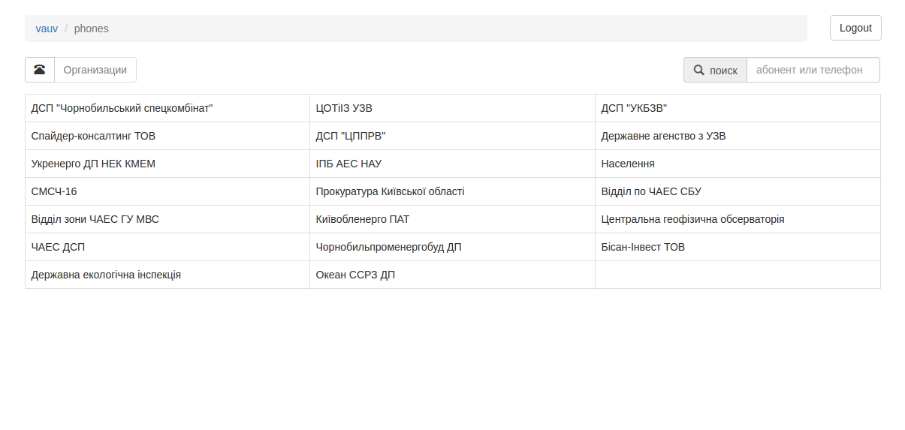
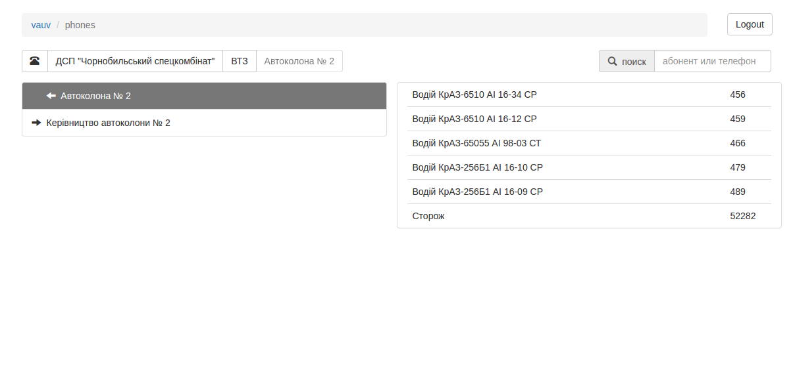
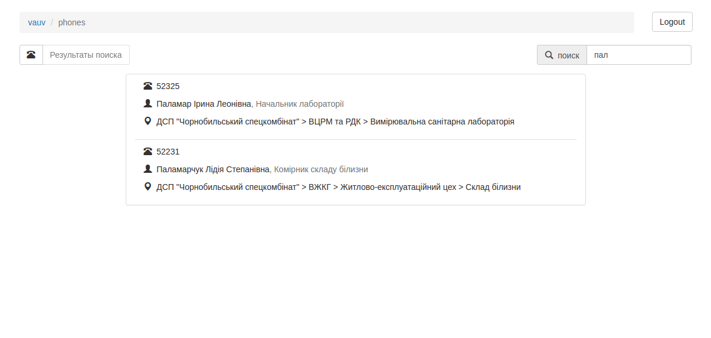
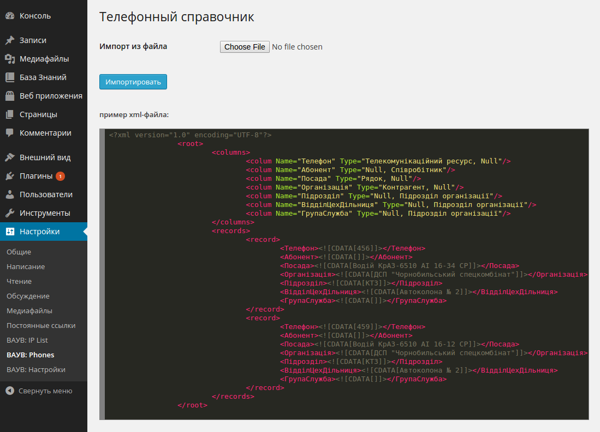

## VAUV Phones

Приложение "Справочник телефонов"

Служит для просмотра и поиска абонентов в телефонном справочнике с возможностью импорта из xml-файла (и возможностью ограничения пользователей к этой функции).

#### Реализация:
- при установке плагина создаёт новую таблицу в базе данных, которую и использует
- добавляет в экран управления пользователями админки сайта дополнительные права ("обновление справочника")
- для обмена данными при поиске, отображении, редактировании, поиске используется `ajax`
- при загрузке данных из xml-файла имеющиеся данные удаляются

#### Использует:
- jQuery
- Twitter Bootstrap
- [Bootstrap Tree View](https://github.com/jonmiles/bootstrap-treeview)
- [WordPress Plugin Boilerplate](http://wppb.io/)

#### Скриншоты
Список организаций

Абоненты организации

Результаты поиска

Импорт данных из xml

